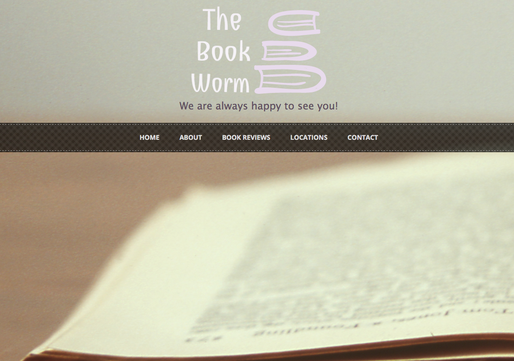

# Independent Book Store Website

## Epicodus Drupal, Week 1: Practice building out basic sites using Drupal

### By: Jordan Meier

### Description

This week's code review is a a website for an independent bookstore, built using Drupal 7.

### Known Bugs

No known bugs at this time.

## Prerequisites

You will need the following things properly installed on your computer.

* [MAMP/WAMP](https://www.mamp.info/en/downloads/)

## Installation

* `git clone <repository-url>` this repository
* change into the new directory
* Open MAMP, click on preferences-> Web Server->Document Root
* Select the project directory.
* Start the Servers.
* In your browser, navigate to: http://localhost:8888/phpMyAdmin/
* Import the database that is located in the sites/all/db-backup called book_store.sql
* Once the database is successfully downloaded, click on it on the far left of the screen, and find the tab at the top of the screen called 'Privileges'.
* Add the following user:
`User name: admin-bookstore
 Host: localhost
 Password: epicodus
`
* click 'go'

## Running / Development

* Visit the site at [http://localhost:8888](http://localhost:8888).
* To log into site maintenance account, use the same user name and password as the database above.

### Technologies Used
* MAMP
* Drupal 7
* Contrib Modules used:
  1. Chaos Tools
  2. Features
  3. Diff
  4. Strongarm
  5. Sweaver
  6. Views
  7. Fivestar
  8. Voting API

###Copyright & Licensing

Copyright (c) 2015 **Jordan Meier**

*This software is licensed under the MIT license.*

Permission is hereby granted, free of charge, to any person obtaining a copy
of this software and associated documentation files (the "Software"), to deal
in the Software without restriction, including without limitation the rights
to use, copy, modify, merge, publish, distribute, sublicense, and/or sell
copies of the Software, and to permit persons to whom the Software is
furnished to do so, subject to the following conditions:

The above copyright notice and this permission notice shall be included in
all copies or substantial portions of the Software.

THE SOFTWARE IS PROVIDED "AS IS", WITHOUT WARRANTY OF ANY KIND, EXPRESS OR
IMPLIED, INCLUDING BUT NOT LIMITED TO THE WARRANTIES OF MERCHANTABILITY,
FITNESS FOR A PARTICULAR PURPOSE AND NONINFRINGEMENT. IN NO EVENT SHALL THE
AUTHORS OR COPYRIGHT HOLDERS BE LIABLE FOR ANY CLAIM, DAMAGES OR OTHER
LIABILITY, WHETHER IN AN ACTION OF CONTRACT, TORT OR OTHERWISE, ARISING FROM,
OUT OF OR IN CONNECTION WITH THE SOFTWARE OR THE USE OR OTHER DEALINGS IN
THE SOFTWARE.
